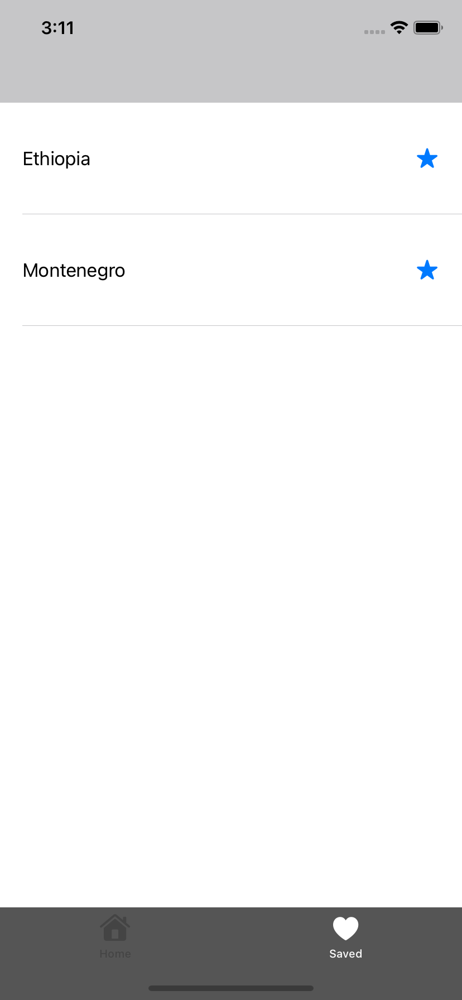

# Countries

## Dependencies
Cocoapods

 Alamofire

## How to install Cocoapods and Alamofire
You can follow the steps in this link to install Cocoapods.
[Link](https://cocoapods.org/)

After installing cocoapods and installing it in the project, you can make the project ready by typing "pod 'Alamofire'" in the podfile.

## Some not working functions
The star in the navigation bar is displayed for visual purposes only. I worked on it but couldn't find the solution.

Any image can be taken and shown from the internet, but due to the direction in the wikimedia links, the image cannot be drawn and displayed on the application.

Example: https://commons.wikimedia.org/wiki/Special:FilePath/Flag%20of%20Namibia.svg --> https://upload.wikimedia.org/wikipedia/commons/0/00/Flag_of_Namibia.svg

## Screenshots

## License
[MIT](https://choosealicense.com/licenses/mit/)
